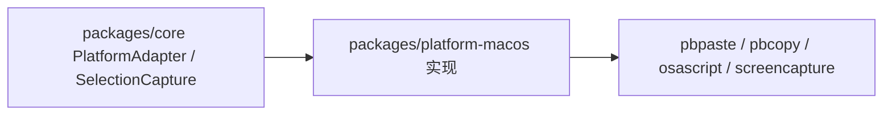
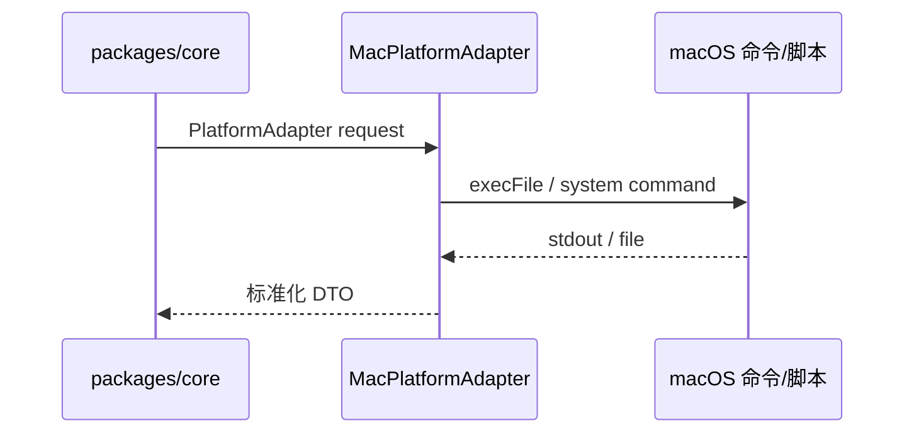

# platform-macos

## 目录职责

`packages/platform-macos` 是 macOS 平台实现层，负责把 core 的抽象协议落到具体系统能力。

## 核心模块

- `MacPlatformAdapter.ts`
- `MacSelectionCapture.ts`

## 在整体架构中的位置

## 模块说明

### `MacPlatformAdapter`

实现 `PlatformAdapter`：

- `currentClipboardText()`
- `frontmostAppInfo()`
- `frontmostWindowList()`
- `captureScreen()`
- `recognizeText()`
- `accessibilitySnapshot()`
- `performAccessibilityAction()`

当前实现状态：

- 已实现：剪贴板、前台 App、窗口列表、区域截图。
- 未实现：OCR、accessibility snapshot、accessibility action。

### `MacSelectionCapture`

实现 `SelectionCapture`：

- 读取原始剪贴板
- 执行复制当前选区的 AppleScript
- 等待系统复制完成
- 再读剪贴板并转成 `SelectionCaptureResult`
- 最后恢复原始剪贴板

## 平台层核心 DTO

### `MacSelectionCaptureDependencies`

- `runAppleScript?`
- `readClipboard?`
- `writeClipboard?`
- `sleep?`
- `waitMs?`

作用：

- 为测试或替换底层系统调用提供可注入依赖。

## 平台层流转

## 设计价值

- core 不需要知道 macOS 命令细节。
- macOS 细节被限制在单独包中，后续可并行增加其他平台实现。
- 平台返回结果统一携带 `resolution: "best_effort"`，便于后续引入更精细的能力等级或权限语义。
